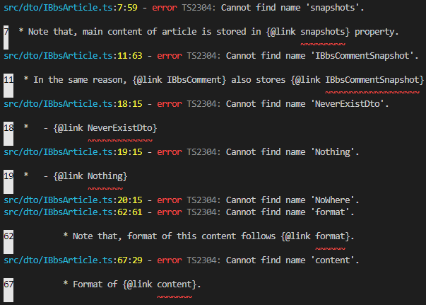

# Error Report


```bash
npm install
npm run build
npm run test
```

Run above commands, then you may meet amazing bug.

TypeScript tries to compile `@link` tagged comments, and occurs error.

The error occured when there's an interface that declared namespace with same name, and imports another type in the namespace. Also, the error occurs only when importing TypeScript file (`await import("file")` statement) after composing `ts.createProgram()` with `ts-node`.

I can't sure that this is a bug of TypeScript or `ts-node`. Therefore, I report this issue both in TypeScript and `ts-node`.

```typescript
import { IBbsArticleSnapshot } from "./IBbsArticleSnapshot";
import { IBbsComment } from "./IBbsComment";

/**
 * Article of BBS.
 * 
 * Note that, main content of article is stored in {@link snapshots} property.
 * The {@link IBbsArticleSnapshot} records would be accumulated whenever updating
 * current article. It is to keep the history of article.
 * 
 * In the same reason, {@link IBbsComment} also stores {@link IBbsCommentSnapshot} 
 * records whenever update it.
 * 
 * -------------------------------------------
 * 
 * Let's link that never exists
 * 
 *   - {@link NeverExistDto}
 *   - {@link Nothing}
 *   - {@link NoWhere}
 *   - {@link NoOne}
 * 
 * @author Samchon
 */
export interface IBbsArticle {
    ...
}
export namespace IBbsArticle {
    export namespace Comment {
        export import IStore = IBbsComment.IStore;
    }
}
```